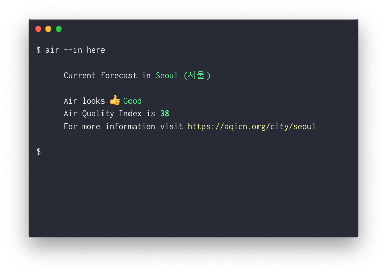

# Air-cli



Air quality commandline App
Search current air quality index by location.

---

## Installation

`npm install -g air-cli`

## API Token

- air-cli uses data from https://aqicn.org/api/
- To use the cli, visit the site and get the token.
- Add your token using `--add` flag.

`$ air --add 29av922123`

## Usage

```
   Usage
    Search by city
    $ air --in <city>

    Add api-token
    $ air --add <Your Token Value>

    Options
      --add, -a         Add API Token
      --token,-t        Show saved token
      --remove, -r      Remove token
      --in, -i          Search by location
      --help, -h        Display Heol

    Examples
    $ air --in here ............. Show Air Quality based on curreent location
    $ air --in Seoul ............ Show Air Quality in Seoul
    $ air --add 2zd82s .......... Add API Token
    $ air --token ............... Show saved token
    $ air --help ................ Show Help

    API
    https://aqicn.org/api/
`,
```

## Data

https://aqicn.org/api/

## License

Licensed under MIT.

## Issues

Report a bug in issues.
Made with love in Seoul by [Yogicat](https://www.github.com/yogicat)
