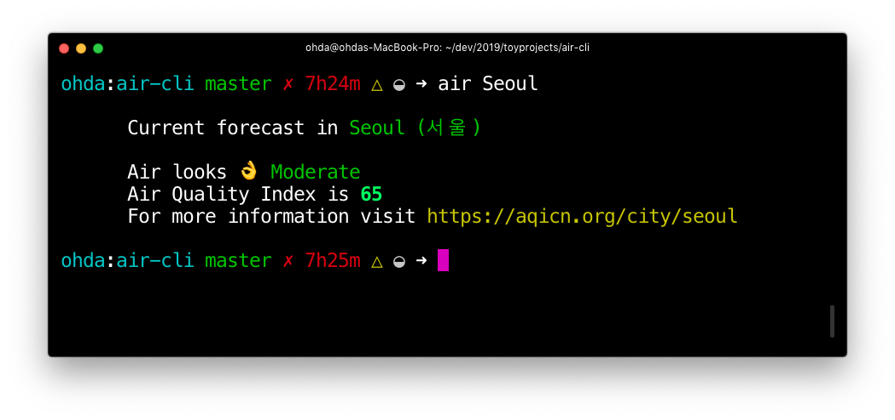

# Air-cli



Air quality commandline Tool
Search current air quality index by location.

위치에 따른 현재 미세먼지 검색 cli

---

## Installation

`npm install -g air-cli`

## API Token

- air-cli uses data from https://aqicn.org/api/
- To use the cli, visit the site and get the token.
- Add your token using `--add` flag.

`$ air --add 29av922123`

- air-cli는 https://aqicn.org/api/의 데이터를 사용한다.
- 해당 사이트에서 토큰을 받아 `$ air --add`로 등록한다.
- 해당 명령어는 자동으로 `.env`를 생성해 TOKEN값을 저장한다.

## Usage

```
  Usage
    Search by city
    $ air --in <city>

    Add api-token
    $ air --add <Your Token Value>

    Options
      --add, -a         Add API Token
      --in, -i          Search by location
      --help, -h        Display Hepl

    Examples
    $ air --in here ............. Show Air Quality based on curreent location
    $ air --in Seoul ............ Show Air Quality in Seoul
    $ air --add 2zd82s .......... Add API Token
    $ air --help ................ Show Help

    API
    https://aqicn.org/api/
```

`$ air --in here` retruns current location's data based on the IP address.

`$ air --in here`는 IP주소에 따라, 현재 위치에 해당하는 공기정보를 제공한다.
